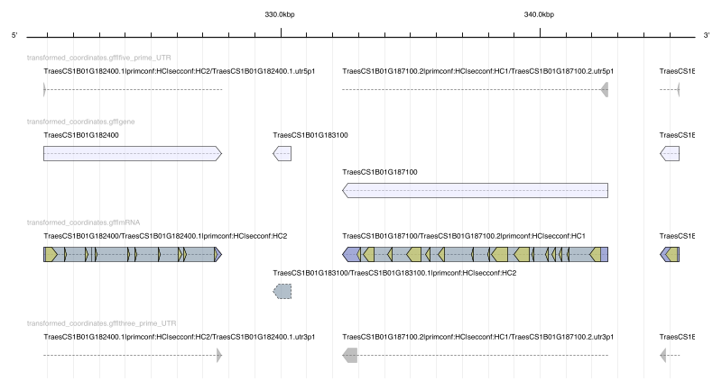
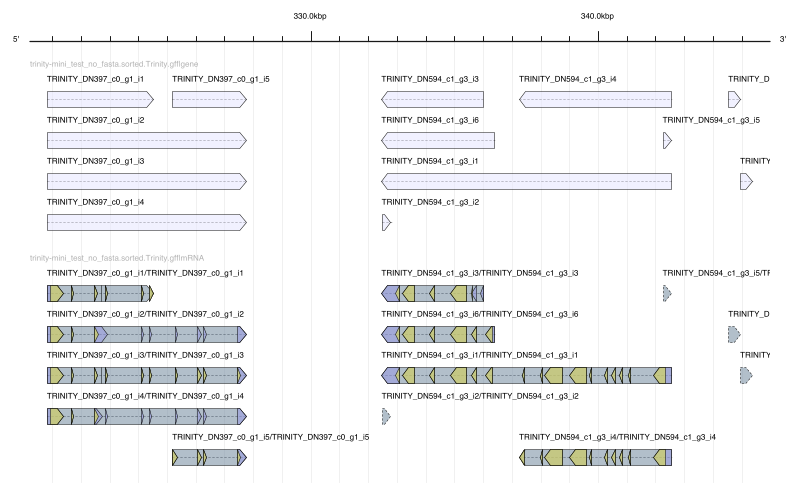

# De Novo Transcriptome assembly with Trinity. 


We are going to divide the group in 4 groups. 

### Group 1 

Samples to assemble: 

```
Sample_104B
Sample_105B
Sample_119B
Sample_120A
```

Trimming: Enabled

### Group 2

```
Sample_104B
Sample_105B
Sample_119B
Sample_120A
```

Trimming: Dissabled 

### Group 3

```
DF19
DF5
Sample_103A
Sample_104B
Sample_105B
Sample_118A
Sample_119B
Sample_120A
spike_Z32_rep1
spike_Z32_rep2
```

Trimming: Enabled

### Group 4

```
DF19
DF5
Sample_103A
Sample_104B
Sample_105B
Sample_118A
Sample_119B
Sample_120A
spike_Z32_rep1
spike_Z32_rep2
```

Trimming: Dissabled 


## Inputs

The inputs are in:

```
/var/scratch/Practical4_Example/reads
```


## Bash template 

Trinity requires    

```sh
#!/bin/bash -e
#SBATCH -p batch
#SBATCH -w taurus
#SBATCH -o log/list_files.%N.%j.out
#SBATCH -n 8
#SBATCH --mem=35G

module load trinity/v2.6.6

left="sample1.r1.fastq.gz,sample2.r1.fastq.gz,sample3.r1.fastq.gz"
right="sample1.r2.fastq.gz,sample2.r2.fastq.gz,sample3.r2.fastq.gz"

Trinity --trimmomatic --seqType fq --max_memory 35G --left $left --right $right --CPU 8 --output my_trinity_output --full_cleanup
echo "DONE"
```


using the ```full_cleanup``` to remove at the end all the temporary files for trinity.  The parameter ```CPU``` is consistent with ```-n``` in ```#SBATCH```. Likewise, the memory should be consistent.  

* What are the steps that trinity is doing? What do you think each step does? 
* Can you try the same argumetns in trimmomatic as used on the previous excercises? 

## Check the contig sizes

Get the size of all the transcripts and get a distribution of the sizes. Compare that with the reference that we had before (```selected_refseq1.0.fasta```).  


## Comparing the annotations. 

To compare this assemblies, we are going to map them using gmap:
```
module load gmap/2015-12-31
```


Copy the ```transformed_coordinates.fasta``` to your folder and create an index for gmap

```
gmap_build -d transformed_coordinates -D gmap  transformed_coordinates.fasta
```


Align your assembly to the Trinity assembly.  

```
gmap --min-intronlength=20 --format=gff3_gene --npaths=1 --ordered --min-identity=0.95 -d transformed_coordinates -D ../References/gmap trinity-mini_test.Trinity.fasta > trinity-mini_test.Trinity.gff
GMAP version 2018-05-30 called with args: gmap.avx2 --min-intronlength=20 --format=gff3_gene --npaths=1 --ordered --min-identity=0.95 -d transformed_coordinates -D ../References/gmap trinity-mini_test.Trinity.fasta
```

We need to sort the GFF file in coordinates, a tool that can be used for this is ```genometools``` http://genometools.org/tools/gt_gff3.html . 

```

gt gff3 -tidy yes -retainids yes -sort yes trinity-mini_test.Trinity.gff > trinity-mini_test.sorted.Trinity.gff
```

We can do this with all the transcriptomes that where generated. 

You can visualize all the transcriptome assemblies at the same time with ```igv```. Look for the differences between the original references (```transformed_coordinates.gff```) and your assembly. Also compare them with the assemblies of other groups. 


Genome tools can be used to produce a plot of a particular region, for example: ```chr1B:320,232-345,985```


```
gt sketch -format pdf -seqid chr1B -start 320232 -end 345985 output1.pdf trinity-mini_test.sorted.Trinity.gff
```

That particular region looks like this: 

#### Original 



#### 4 samples no trimming  



#### 4 samples, trimmed 


